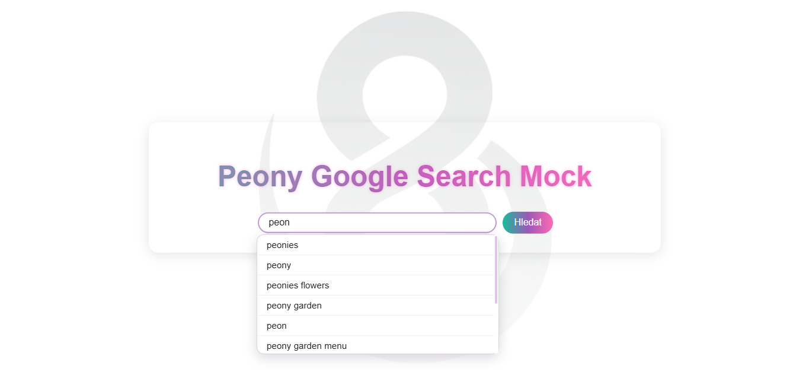
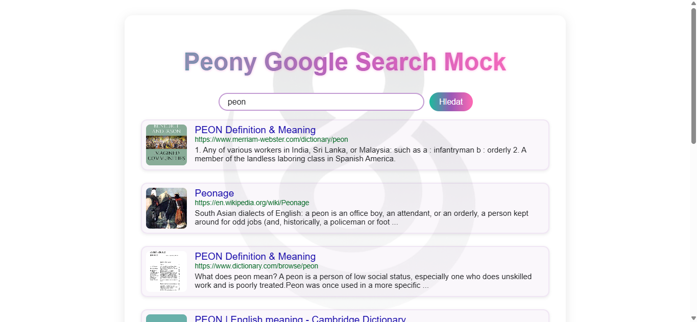

# Google Search – Full-Stack Application

[](https://peony-google-search-mock.vercel.app/)
[](https://reactjs.org/)
[](https://nodejs.org/)

---

# 🔍 Google Search – Full-Stack Application

## 📝 Context and Project Goal

This project was developed as a **technical hiring assignment** for the company **INIZIO**.

The goal was to design and deliver a **production-ready full-stack solution** covering:

* frontend application architecture,
* backend API design,
* testing strategy,
* Docker-based containerization,
* and a robust cloud deployment strategy using **Serverless Functions**.

---

## 🚀 Live Demo

**Frontend (Vercel):**
👉 [https://peony-google-search-mock.vercel.app/](https://peony-google-search-mock.vercel.app/)

**Backend API (Vercel Serverless):**
👉 [https://google-search-backend-mu.vercel.app/](https://google-search-backend-mu.vercel.app/)

---

## 🏗️ Application Architecture

The project is structured into **frontend and backend layers**, optimized for **cloud performance, scalability, and maintainability**.

### 🔹 Backend (Serverless)

Implemented using **Node.js + TypeScript** and deployed as **Vercel Serverless Functions**.

**Backend characteristics:**

* **Modular architecture** – clean separation of routes, services, and controllers
* **API integration** – robust connection to Google Custom Search API and SERP API
* **CORS & security** – dynamic CORS configuration supporting preview and production environments
* **Data normalization** – transformation pipeline ensuring consistent frontend-ready data structures
* **Testing** – comprehensive unit and integration tests using **Jest**

---

### 🔹 Frontend

Implemented using **React + TypeScript + Vite**, with a strong emphasis on clarity and performance.

Core principles:

* **Feature-first structure** – scalable component organization
* **Custom hooks** – business logic abstracted into `useSearch` and `useUI`
* **Dynamic environment handling** – seamless switching between local development and production APIs
* **Tailwind CSS** – modern, responsive UI inspired by the classic Google search experience

---

## ✨ Key Features

* **Keyword Search** – real-time Google search results
* **Clean Data** – organic results only, filtered from ads and clutter
* **Image Enrichment** – automatic result enrichment with high-quality thumbnails
* **JSON Export** – ability to download structured search results
* **Optimized UI** – fast, accessible Single Page Application (SPA)

---

## 📸 Screenshots

### Home Page



### Search Results



## 🛠️ Tech Stack

### Backend

* Node.js
* Express
* TypeScript
* Google Custom Search API / SERP API
* Jest (unit & integration tests)
* Deployment: **Vercel Serverless Functions**

### Frontend

* React 18
* Vite
* TypeScript
* Tailwind CSS
* Jest + React Testing Library
* Deployment: **Vercel (Static Hosting)**

### Infrastructure

* **Docker** – full containerization for local development (`docker-compose.yml`)
* **CI/CD** – automated deployment pipeline via Vercel & GitHub integration

---

## 📂 Project Structure

```text
google_search/
├─ backend/
│  ├─ api/             # Vercel entry point
│  ├─ src/
│  │  ├─ routes/
│  │  ├─ services/
│  │  └─ __tests__/
│  └─ vercel.json      # Serverless configuration
│
├─ frontend/
│  ├─ src/
│  │  ├─ app/
│  │  │  ├─ components/
│  │  │  ├─ hooks/
│  │  │  └─ services/
│  └─ .env.example
│
├─ docker-compose.yml
└─ package.json
```

---

## ⚙️ Local Development

### 1️⃣ Backend

```bash
cd backend
npm install
npm run dev
```

Requires `.env` with the following variables:

* `GOOGLE_API_KEY`
* `GOOGLE_CX`
* `SERP_API_KEY`

---

### 2️⃣ Frontend

```bash
cd frontend
npm install
npm run dev
```

The frontend uses **Vite Proxy** to communicate with the local backend at:

👉 [http://localhost:3001](http://localhost:3001)

---

## 👤 Author

**Jan Pivoňka**
GitHub: [https://github.com/janpivonka](https://github.com/janpivonka)
